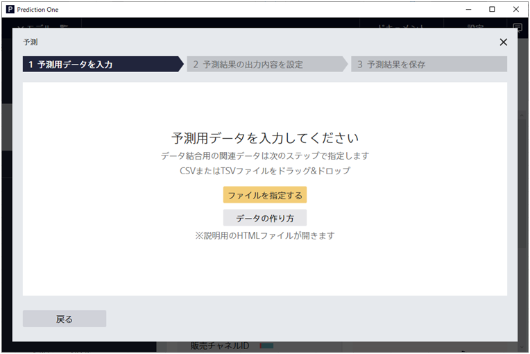
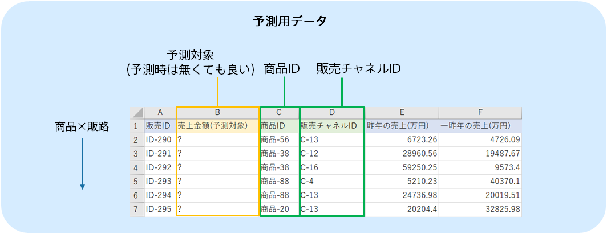
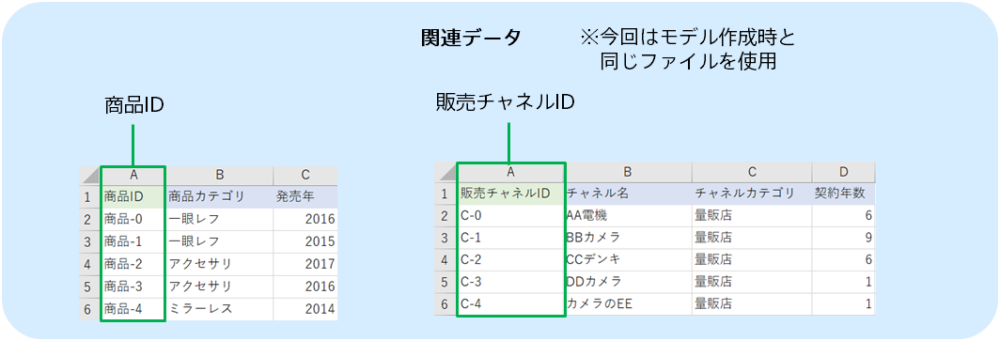
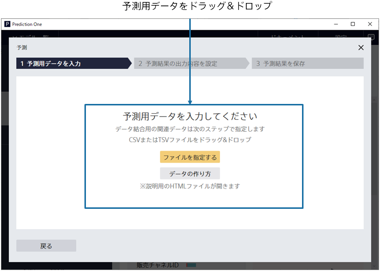
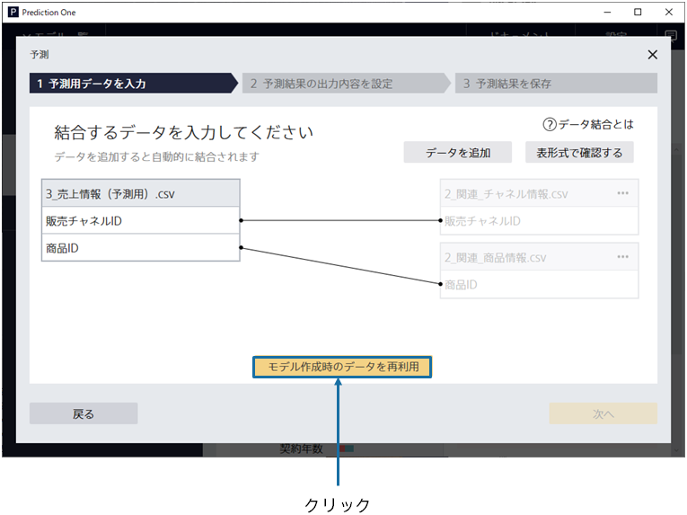
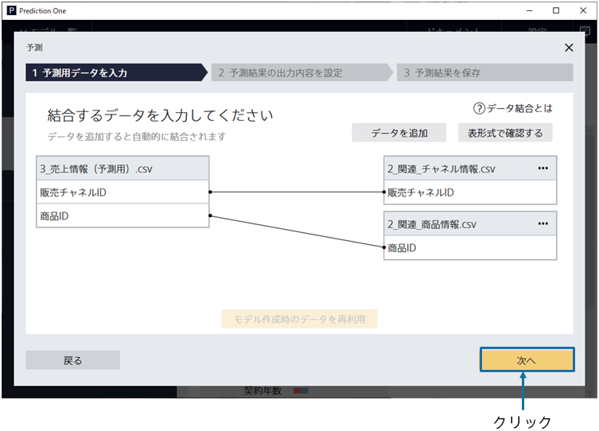
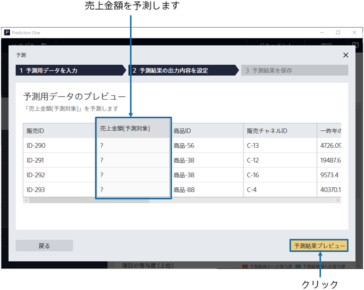
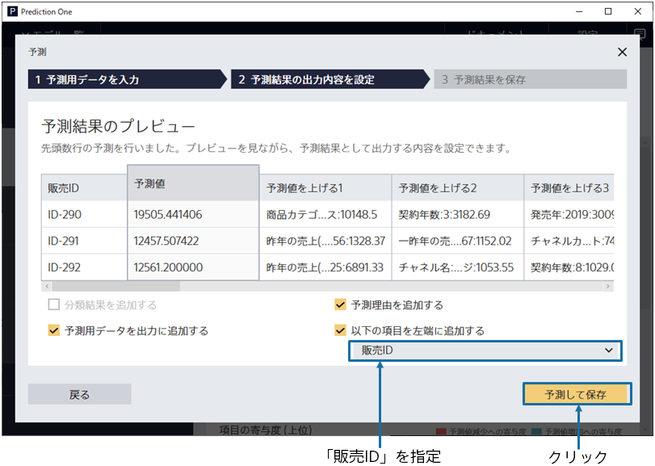
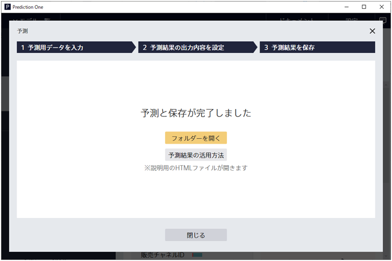
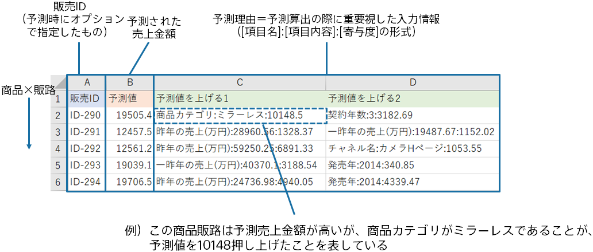

{}

この画面にて、予測用データを指定します。今回のチュートリアルで使用する予測用データの内容を確認しましょう。
{}

{}

作成した予測モデルを利用して、入荷数が未定の商品（約 100 種類）に対して、売上金額を予測します。 
本チュートリアルでは、事前に準備した予測用のサンプルデータを利用します。
予測モデル作成(学習)用データとは違い、売上金額の項目は利用しません。

{}
{}

{}

予測用データである`3_売上情報（予測用）.csv`を指定してください。 
{}
データはウィンドウへのドラッグ&ドロップか 「ファイルを指定する」で読み込むことができます。 
{}
{}
サンプルデータは、「アップロード済みのデータから選択」をクリックし、「サンプル」タブのデータ一覧から選択してください。
{}

{}
{}

{}

続いて、関連データを指定します。

本チュートリアルの関連データには予測対象の商品・販売チャネルに関する関連情報も含まれているので、
「モデル作成時のデータを再利用」ボタンをクリックしてください。 
関連データが追加され、予測用データと関連付けられました。

「次へ」をクリックしてください。

{}

{}

結合後の予測用データのプレビューが表示されます。

「？」で表示されている「売上金額（予測対象）」を「販売チャネル ID」など他の情報から予測します。

{}
「予測結果プレビュー」をクリックしてください。
{}
{}
「予測を実行」をクリックしてください。予測結果のプレビュー画面が表示されるまで、しばらくお待ちください。
{}
{}

{}

{}
「以下の項目を左端に追加する」にて「販売ID」を指定してください。

その後、「予測して保存」をクリックしてください。
各行ごとに予測を行い、その結果を保存します。

「予測して保存」をクリックした後、名前を付けて保存するダイアログが表示されます。
ファイル名を指定して予測結果を保存してください。
{}
{}
「以下の項目を左端に追加する」にて「販売ID」を指定してください。
「予測結果を保存」をクリックし、「ファイル名」を入力し、「保存」をクリックしてください。
{}
{}

{}
予測が完了すると以下の画面が表示され、指定したファイルに予測結果が保存されています。

予測結果は以下のような形式で出力されます（オプション設定によっては違う形式になります）。
各商品に対して、販売チャネル別に予測された売上金額が算出されています。

{}
