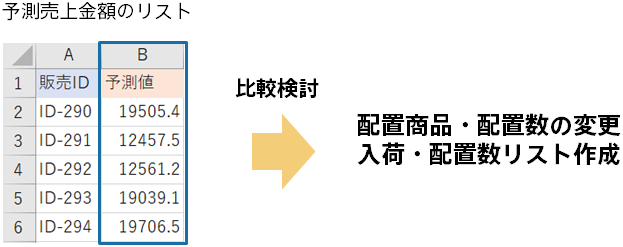

{}

You were able to predict the sales amount of each product by sales channel for the next fiscal year.

Compare the calculated prediction with the previous method to see if it is accurate.
Based on the predicted values, you adjust the amount of product placements and implement marketing measures for sales channels with low predicted sales amounts, taking into account situations that do not appear in the data.

{}
