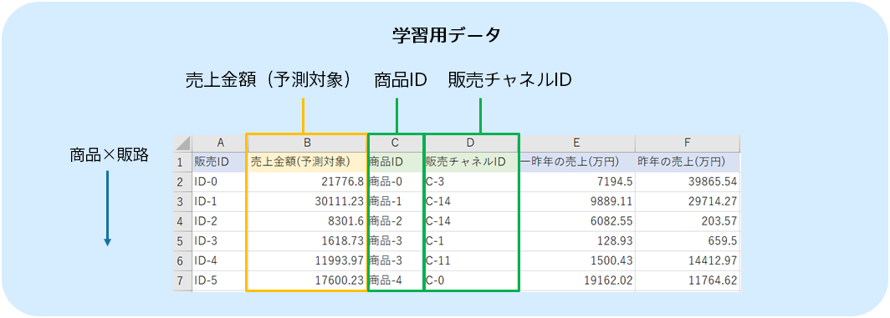
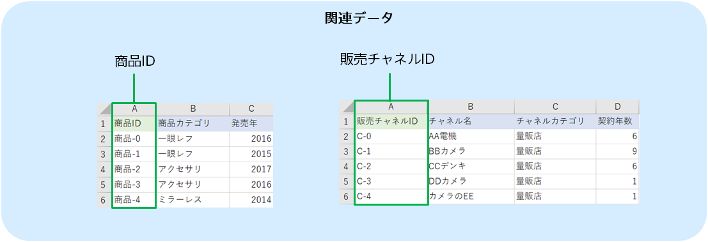

In predictive analytics, you create a prediction model that predicts sales amounts by using sales performance data for each sales channel of each product as prediction model creation (training) data and product attribute data and sales channel attribute data as related data, as shown below. 
The prediction model learns which kind of sales channel to sell through, what kind of products, and how much the sales amount is, from the prediction model creation (training) data and related data.
This tutorial uses sample datasets that were prepared.

{}

The following pages describe how Prediction One operates.
