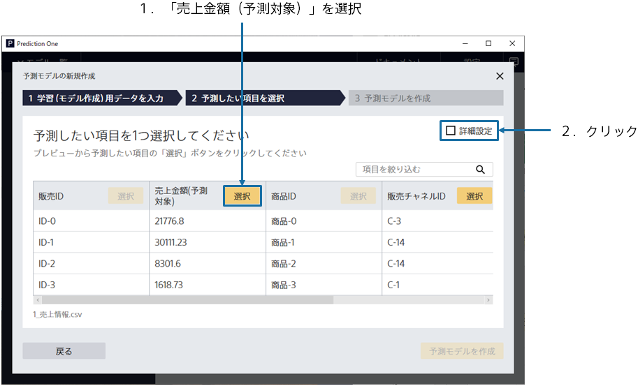

{}

The main screen appears, no prediction model has been created, so it is empty. Click [Create New Prediction Model].
{}

{}

Specify `1_売上情報.csv`, the data for creating a prediction model (training). 
{}
You can import the prediction model creation (training) data by dragging and dropping it into the window or by [Select a File]. 
{}
{}
Click "Select from Uploaded Data" and select the sample data from the data list on the "Samples" tab.
{}

{}
{}

{}

This screen is displayed when data loading is completed. 
Please select one variable to predict. For this tutorial, select the variable "Sales amount (Prediction target)" 
After making your selection, click the checkbox for **Advanced settings** in the upper right to enter Advanced mode. 

Click the **Data Join button** at the bottom right of the advanced setting mode screen.

{}
