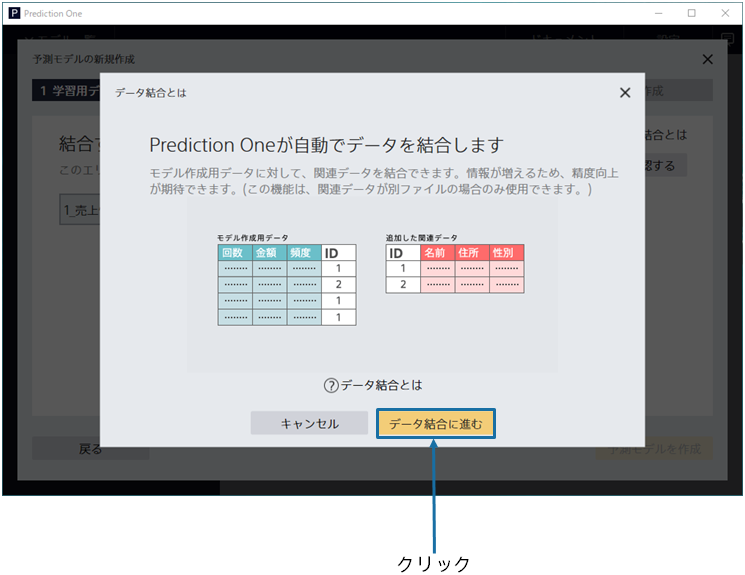
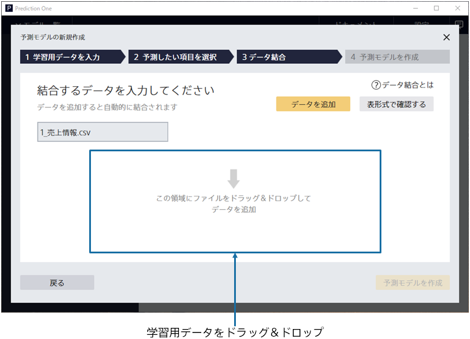
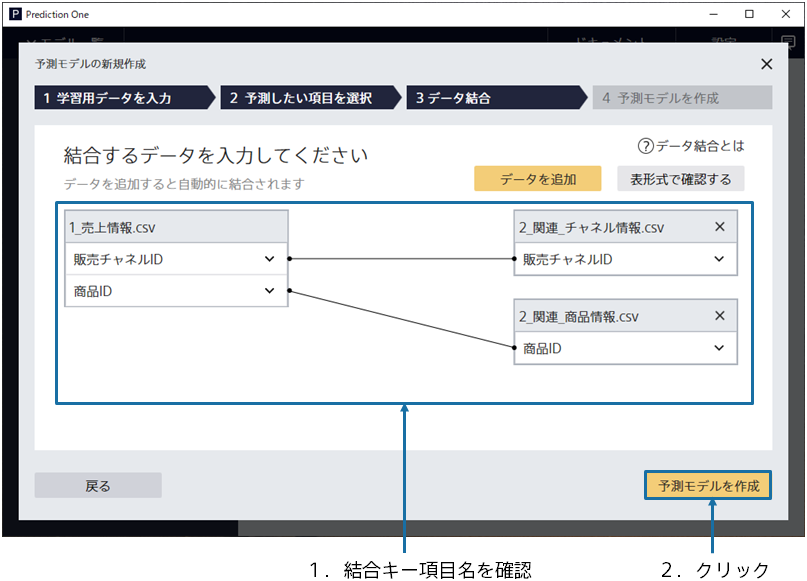
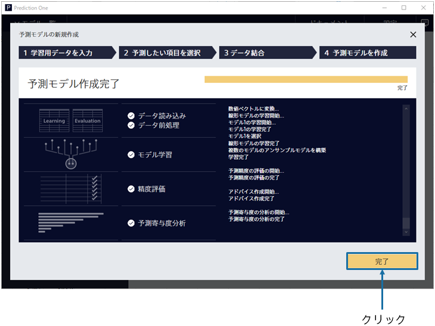

{}

Click the [Data Join] button to launch the animation window for the data join. Click the [Go to Data Join] button.
Moves to the data join screen.

Specify the related data `2_関連_チャネル情報.csv` and `2_関連_商品情報.csv`. 
You can drag and drop them into the window or import them from the "Add Data" button. 

{}
{}

{}

When the data import is complete, two related pieces of data are added to the screen.
The Join Key variables that map the prediction model creation (training) data to the related data are also displayed. 
Make sure that the Join Key variables are selected correctly and click the "Create Predictive Model" button. 
{}

{}

Please wait until the learning begins. Four processes are executed: Preprocessing → Prediction Model Learning → Accuracy Evaluation → Predictive Contribution Analysis. 
The estimated wait time is displayed at the top. The more data you have, the longer it takes. 
When you have completed your learning, click the [Completed] button. 
{}
