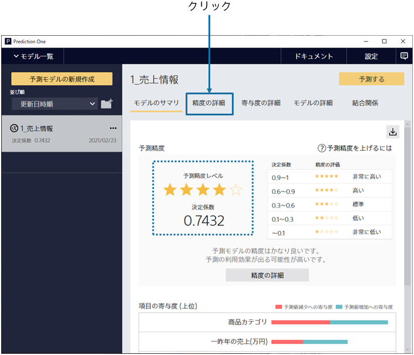
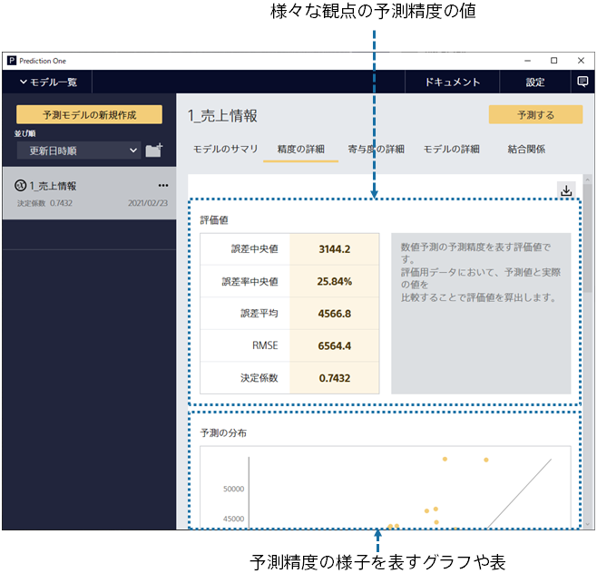
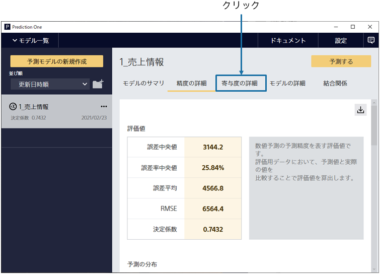
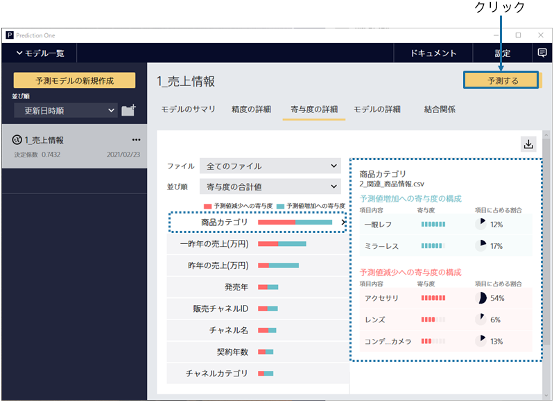

{}

After learning the prediction model, it automatically evaluates the prediction accuracy. This screen provides a summary of the model evaluation.

The prediction accuracy is calculated by comparing the actual results with the predicted results of the prediction model that is created. 
We found that we can predict the sales amount with good accuracy from the number of stars at the prediction accuracy level!
{}

{}

Select "Evaluation" to see a more detailed evaluation. 
Evaluated values of prediction accuracy from various perspectives and tables and graphs of prediction accuracy are generated. You can scroll down to browse.
{}

{}

We found that the prediction accuracy is high. So why is the prediction accuracy high? 
Click "Understanding".
{}

{}

Product Category is effective, and from the contents on the right side, you can see that the sales prediction for single-lens reflex cameras and mirrorless cameras was high this year.

The past sales amount was originally the only variable included in the prediction model creation (training) data, but because
the "product category "variable added from the related data is ranked highly in terms of contribution,
indicating that a prediction model has been created that utilizes the related data.

Then click "Predict".

{}
