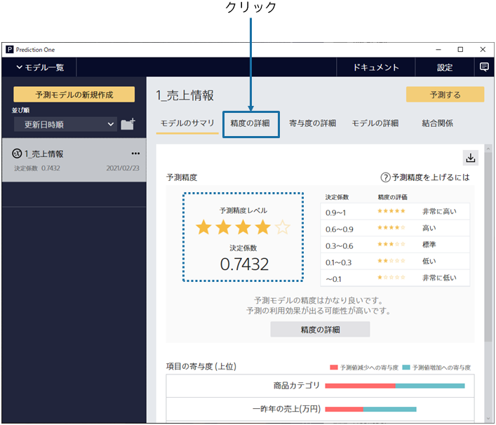
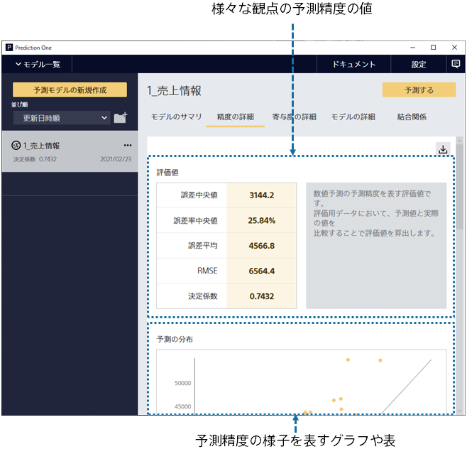
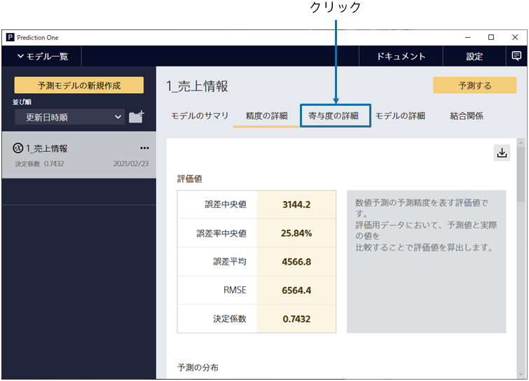

{}

予測モデルの学習後、予測精度の評価までを自動で行います。この画面ではモデルのサマリを確認できます。

予測精度は作成した予測モデルの予測結果と実際の結果を比較することで算出されます。 
予測精度レベルの星の数から、良い精度で売上金額を予測できる事がわかりました！
{}

{}

「精度」を選択すると、さらに詳細な評価を見ることができます。 
さまざまな観点での予測精度の評価値や、予測精度に関する表やグラフが生成されます。下にスクロールすることで閲覧できます。
{}

{}

予測精度が高いことはわかりました。では、なぜ予測精度が高いのでしょうか。 
「寄与度」をクリックしてください。
{}

{}

「商品カテゴリ」が有効で、さらに右側の内容から、一眼レフやミラーレスだと今年の売上予測値が高かった事がわかります。

また、もともと予測モデル作成(学習)用データに含まれていた項目は過去の売上金額に関する情報だけでしたが、
関連データから追加された項目「商品カテゴリ」が寄与度の上位にランクインしている事から、
関連データを活用した予測モデルが作成されていることがわかります。

次に「予測する」をクリックしてください。

{}
