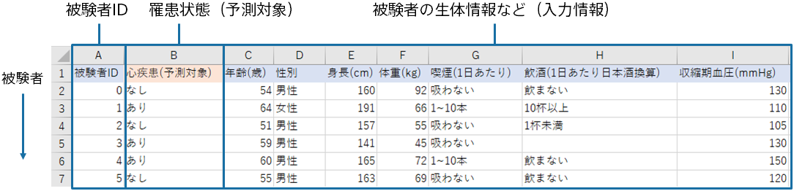

In this tutorial, we use the following prediction model creation (training) data that mimics cohort data that summarizes information on subjects and the results of heart disease.
The prediction model learns from the prediction model creation (training) data that the disease state variable is likely to be "Affected" if the cohort information is this.

This tutorial uses sample datasets that were prepared.

**Sample data used in the tutorial is fictitious data.**

{}

The following pages describe how Prediction One operates.
