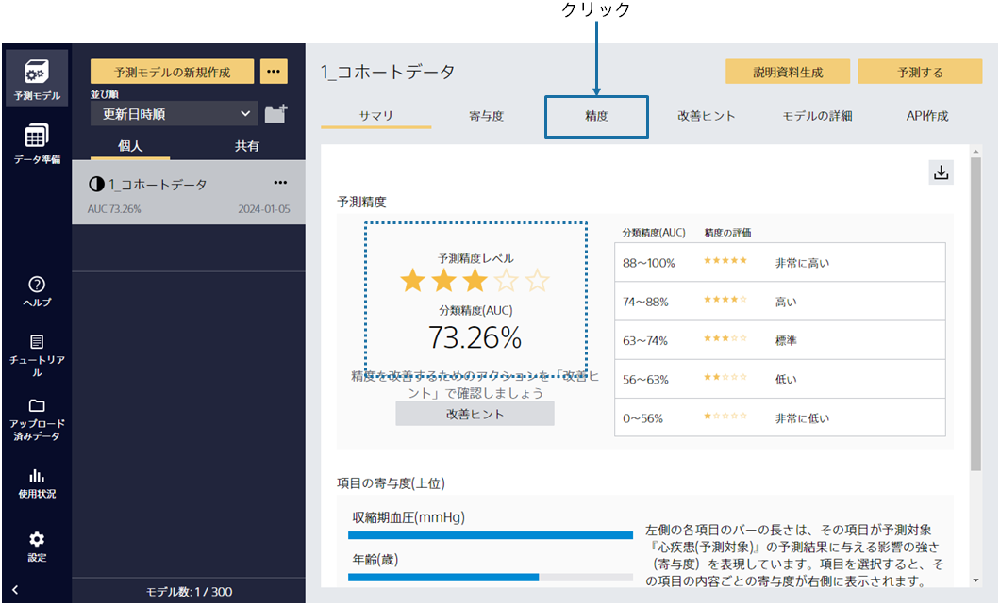
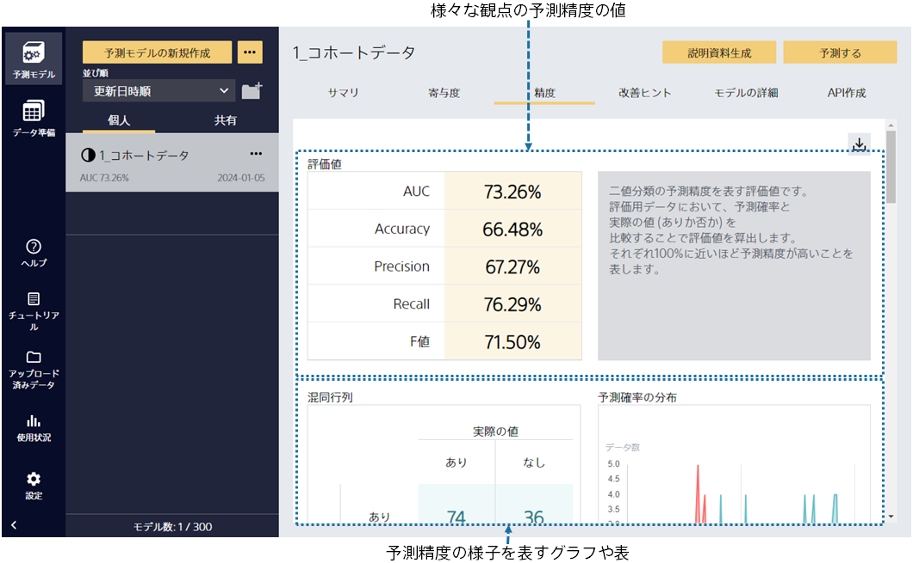
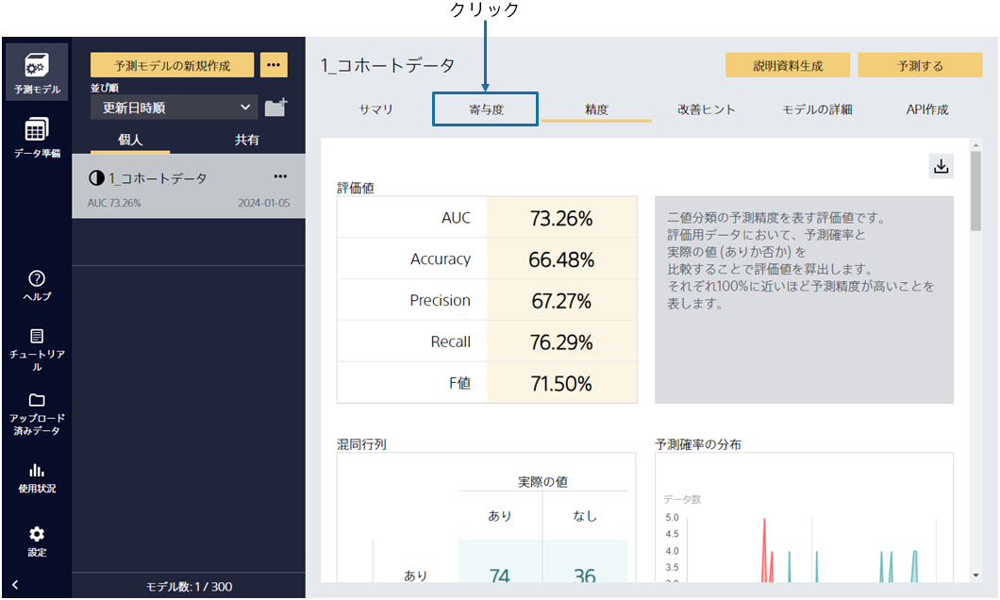
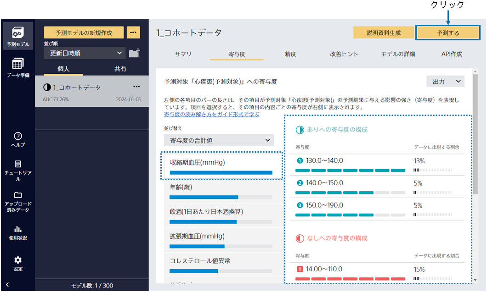

{}

予測モデルの学習後、予測精度の評価までを自動で行います。この画面ではモデルのサマリを確認できます。

予測精度は作成した予測モデルの予測結果と実際の結果を比較することで算出されます。
{}

{}

「精度」を選択すると、さらに詳細な評価を見ることができます。
さまざまな観点での予測精度の評価値や、予測精度に関する表やグラフが生成されます。下にスクロールすることで、閲覧できます。
{}

{}

予測精度の値はわかりました。では、「寄与度」をクリックしてください。
{}

{}

今回作成した予測モデルでは、「収縮期血圧(mmHg)」を有効な項目として捉えており、さらに右側の内容から
「収縮期血圧(mmHg)の数値が高い場合」だと、モデルが罹患確率をより高く予測する傾向にあること等がわかります。
次に「予測する」をクリックしてください。
{}
