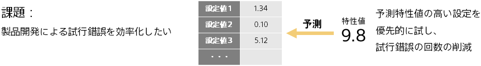

### はじめに ～特性予測による開発の効率化～

製造業等では、商品開発を行う際に、さまざまな設定値の試行錯誤をするケースがあります。たとえば、

- 材料開発の際に、目標とする特性（硬さなど）が出るように、複数の原材料の混合量率を最適にする
- 製品開発の際に、目標とする特性（歩留まりなど）が出るように、製造機器や設計上の設定値の調整を行う
- ソフトウェアから良い特性（消費電力など）が出るように、複数のパラメータをチューニングする

特性値の計測にコスト・時間を要する場合は、上記の試行錯誤にかなりの時間を要することになります。

予測分析を利用すると、過去の試行錯誤のデータから、設定（例：混合量率、設定値、パラメータ設定）に対する特性値を予測できるようになります。
これを利用することにより特性値が高くなる設定の当りをつけることができるため、経験と勘による試行錯誤よりも、試行錯誤が効率的に進められる可能性があります。

