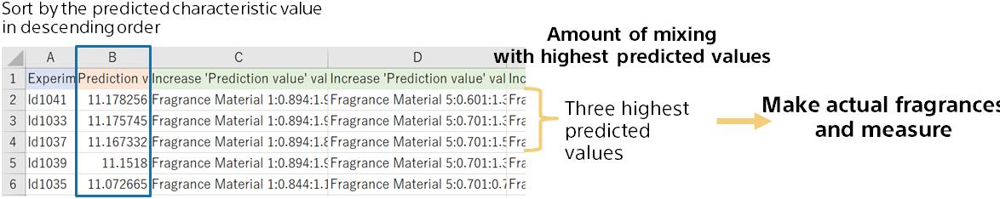

{}

Mixing amounts with large predicted characteristic values are likely to actually have large characteristic values.
Sorts in descending order of predicted values, and actually creates fragrances for mixtures with large predicted values and measures characteristic values.

From the mixing amount of 51 patterns prepared beforehand, the mixing amount that can be expected to have a good characteristic value was narrowed down.
{}
