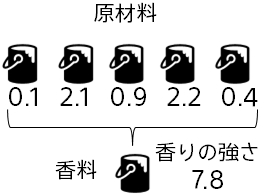

#### Situations and Challenges: Tough trial and error in product development of fragrances

You are in charge of product development at a material manufacturer. You are currently developing a fragrance
You are trying to make it with as strong a fragrance as possible from five ingredients. Mixed amount of raw materials
It is known that the characteristics of fragrance (intensity of fragrance) vary depending on the ratio .
While mixing and characterizing raw materials can be time-consuming, the number of combinations of quantities in a mixture can be significant
so it can take a considerable amount of time to determine the optimum quantity of mixture. It seems like a more
efficient method is needed.

#### Using Predictive Analytics: Predicting Characteristics Based on Data

- Prepare data summarizing past raw material mix quantities and their characteristics (you will use sample datasets in the tutorial.)
- Prediction One is used to predict characteristic values for untested mixtures
- Based on the predicted properties, determine the amount of mixing to be tested.

#### Expected Effect: More efficient trial and error

Since the characteristic value can be predicted, the quantity of mixture with a good characteristic value can be determined, and a good quantity of mixture can be found with a small number of trials.

**Now let's do a characteristic prediction with Prediction One!**
