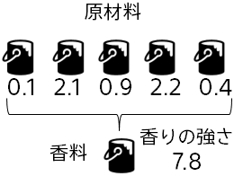

#### 状況と課題：香料の製品開発における試行錯誤が大変

あなたは、材料メーカで商品開発を担当しています。現在香料の開発を行っており、
５つの原材料からできるだけ香りの強い香料を作ろうとしています。原材料の混合
比率によって、香料の特性（香りの強さ）が変わってくることがわかっています。
原材料の混合や特性の計測には時間がかかる一方、混合量の組合せ数がかなり
あるため、最適な混合量の決定にはかなり時間がかかってしまっています。より効
率的な方法が必要だと感じています。

#### 予測分析の活用：データに基づく特性の予測

- 過去の原材料混合量とその特性をまとめたデータを準備（チュートリアルでは、サンプルデータを使用します）
- Prediction One を利用して、まだ試していない混合量に対する特性値を予測
- 予測した特性値に基づき、次に試していく混合量を決める

#### 期待される効果：試行錯誤の効率化

特性値が予測できるため、良い特性値を持つ混合量の当りが付けられ、少ない試行回数で良い混合量を見つけられる

**それでは、実際に Prediction One で特性予測をしてみましょう！**
