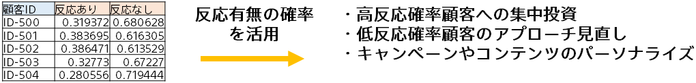

{}
DM反応の予測により各顧客の反応確率が明らかになりました。 
予測結果に基づき、それぞれの顧客に投資するリソースやアプローチを最適化します。

高い反応確率を示す顧客群に対して、よりパーソナライズされたDMを送付し、コンバージョン率のさらなる向上を狙います。 
低い反応確率を示す顧客に対しては、DM以外のコミュニケーション手段（例：SNS、SEM）を検討、またはDMの内容やオファーを見直して再アプローチを図ります。 
また、この予測結果をもとにセグメント化した顧客の興味や過去の購買行動に合わせてカスタマイズされたコンテンツやオファーを提供することも有効です。

{}
