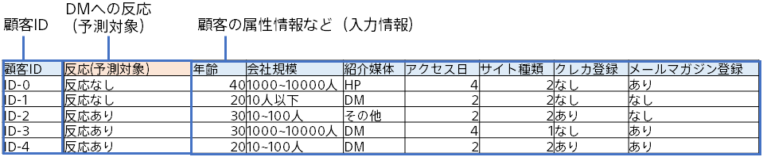

予測分析では、下記のような、顧客データを予測モデル作成(学習)用データとして用いて、DM反応を予測する予測モデルを作成します。予測モデルは、予測モデル作成(学習)用データからこういった顧客はDMに反応する・しないといったことを学習します。 本チュートリアルでは、すでに準備してあるサンプルデータを利用します。

{}

以降のページでは、Prediction One の操作について説明します。
