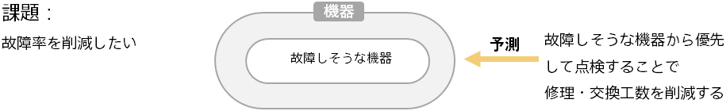

### Introduction: Preventing failures by predicting equipment failures

One of the challenges facing the manufacturing industry is how to reduce equipment failures, such as manufacturing equipment at factories or equipment delivered to customers.

By applying predictive analytics to equipment status data, you can predict the failure probability of each piece of equipment. It is difficult for humans to estimate the failure of each piece of equipment. Because equipment that is likely to fail can be identified in advance, measures such as determining the priority order of inspection based on the failure probability can be expected to reduce the cost of repair and equipment replacement due to failure.

