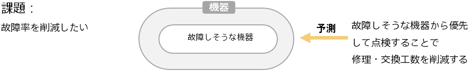

### はじめに ～機器の故障予測による故障の未然防止～

工場における製造機器や、顧客へ納入した機器など、機器の故障をいかに減らすかが製造業では課題の１つです。

機器の状態データに予測分析を適用すると、機器ひとつ一つの故障確率を予測できます。機器のひとつ一つの故障を見積もるなど、人間では困難です。 故障しそうな機器が事前にわかることになるので、故障確率を元に点検の優先順を決定するなどの施策を行うことで、故障による修理・機器交換にかかる費用を削減することが期待できます。

