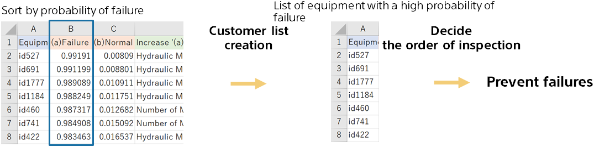

{}

Sorts the predicted result files in order of probability of failure.
After sorting, the top 50 units are selected for priority inspection as a list of equipment with a high failure rate.

The different types of equipment may be reflected in the prediction reasons. it may be reflected in the contents of the inspection.
{}
