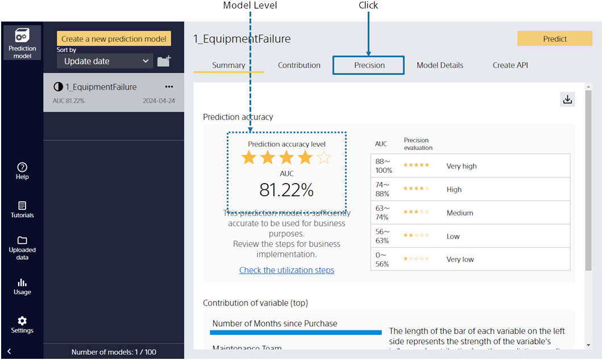
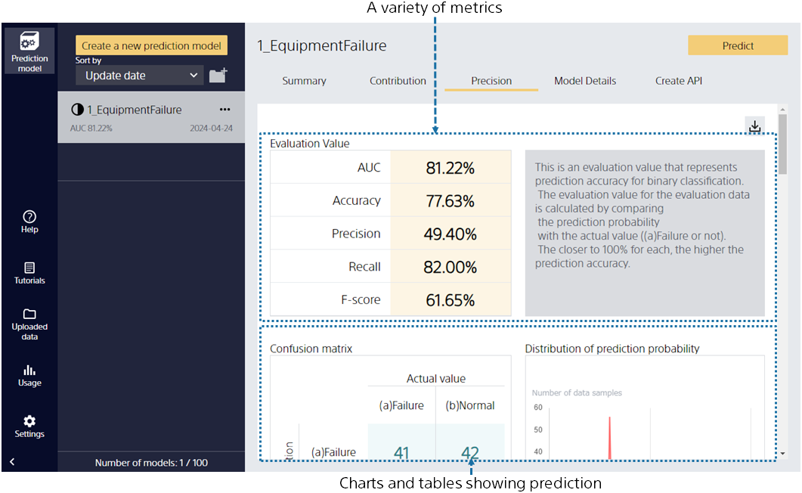
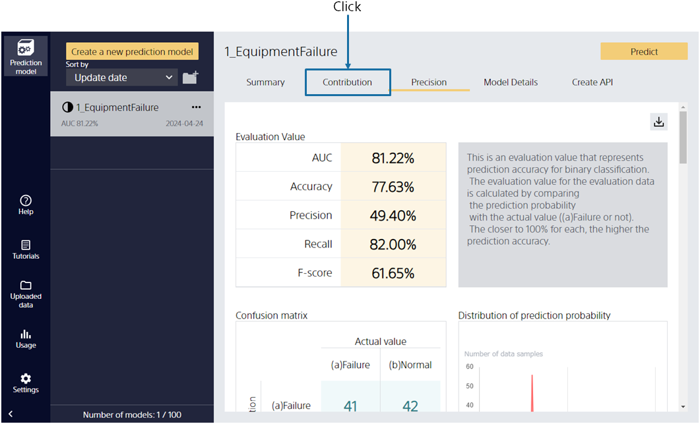
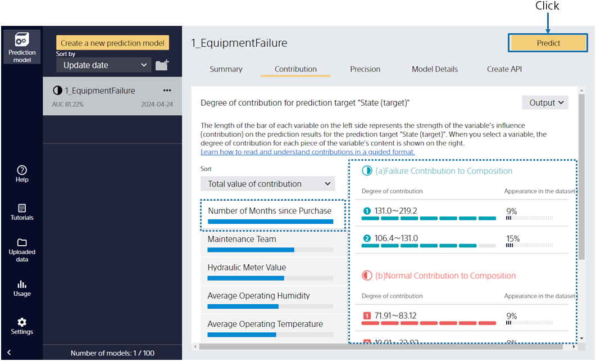

{}

After learning the prediction model, it automatically evaluates the prediction accuracy. This screen provides a summary of the model evaluation.

The prediction accuracy is calculated by comparing the actual results with the predicted results of the prediction model that is created.
We found that we can predict the failure with good accuracy from the number of stars at the prediction accuracy level!
{}

{}

Select "Evaluation" to see a more detailed evaluation.
Evaluated values of prediction accuracy from various perspectives and tables and graphs of prediction accuracy are generated. You can scroll down to browse.
{}

{}

We found that the prediction accuracy is high. So why is the prediction accuracy high?
Click "Understanding".
{}

{}

This screen allows you to see which variables are effective for prediction and how they are effective.

According to the failure prediction,
"Number of months since purchase" is effective, and further from the contents on the right side
it is understood that the greater the number of months since purchase, the more likely failure is to occur.
You can check if it matches your intuition.
You can also discover unexpected relationships (The hydraulic meter value was related to failure or non-failure).

Then click "Predict".
{}
