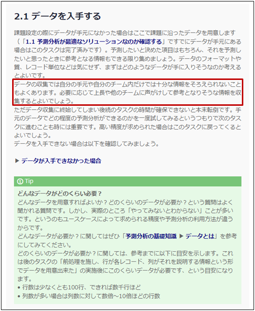

{}
一度は飛ばしてしまったが、「2.1 データを入手する」の

<blockquote>

データの収集では自分の手元や自分のチーム内だけでは十分な情報をそろえられないこともよくあります。必要に応じて上長や他のチームに声がけして参考となりそうな情報を収集するとよいでしょう。

</blockquote>

をやり直す必要がある。 
  

  
ユーザのより詳細な情報を集めればとは考えたものの、それぞれの顧客のジムまでの近さだったり、利用時間帯だったり、はうちのチームでは管理していない…。こういったデータはシステム部が持っていたり、さらに詳細な情報はもしかしたら各店舗レベルでしかデータを持っていないかもしれない…。 
上長に掛け合ってシステム部からより詳細な情報を得られないか相談してみよう。コンピテンシー活動は部署間のコミュニケーション促進も目的にされているから何とかなるはずだ。 
しかもシステム部だったら顧客データにどんなデータがあるのか把握していそうだぞ。


タケシさんはより詳細なデータを得るためにはシステム部や各店舗の協力が必要かもしれないことに気づきます。これは予測分析プロジェクトでは珍しいことではありません。予測分析に限らずデータ活用を始めようとしたとき、データが一元管理されていなかったり、きれいに成形されていなかったり、といったことはよくあることです。 
ご自身のケースで予測分析をする際も、ぜひデータ活用の必要性を説明してデータを協力部署から得られないか交渉してみましょう。

{}

{}
システム部との協議の結果、それぞれの顧客に対するジムへのログイン/ログアウト履歴をもらうことができた。他にも顧客の住所と契約店舗の情報も得られた。 
  
チェックリストに従うと次は可視化と前処理だ。システム部からもらったログイン/ログアウト履歴は、顧客ID、ログインorログアウト、記録時間が列挙されただけの雑多なcsvだ。ひとまずログイン時間やログアウト時間のピークを可視化して自分の感覚と相違ないことは確認した。しかし、これは今まで使っていたcsvと直接は結合できない…。パーソナル申し込みに関係ありそうな情報としては、「週利用回数」「週平日利用回数」「週休日利用回数」「利用時間帯」「平均滞在時間」くらいかなぁ。これを前処理で用意しなければ…。 
  
「ジムまでの徒歩分」みたいな情報も欲しかったが、これをやろうとすると、顧客の住所と契約店舗の住所をGoogleマップに入力して徒歩分を出して…というのを顧客の数だけやる必要があるのか…？プログラミングができれば自動化して一気に処理できるのかもしれないが…。 
ひとまずログイン/ログアウト履歴から追加できる情報でデータ前処理をして、予測モデルを作り直してみよう！後続の「2.4 予測対象以外の項目は予測時も手に入るデータであることを確認する」についても今回もらったデータでは問題はなさそうだ。


交渉の結果、タケシさんはログイン履歴のデータを入手できましたが、そのままでは行が1顧客、列が顧客を説明する情報というPredictionOneに入力するデータの形式には合っていなかったため、前処理を行いました。 
BIツールの入力のように集まるデータは成形されたものだけとは限りません。予測モデルの制度改善に役立ちそうな情報は前処理をしてなるべく用意できるとよいでしょう。

{}

{}
このページでタケシさんは以下のタスクを完了しました。

- 2.1 データを入手する
- 2.2 データの可視化などで素性を把握する
- 2.3 前処理を施し、行が各レコード、列がそれを説明する情報という形でデータを用意する
- 2.4 予測対象以外の項目は予測時も手に入るデータであることを確認する

ここではタケシさんになったと思って進め方ガイドのチェックを埋めてみましょう。
  

  
<link rel="stylesheet", href="../../../../../static/css/help.css">
<a href="../p11/index.html" class="nav nav-tutorial-next">「『4.2 寄与度を確認する』に取り組む」にすすむ</a>
{}
