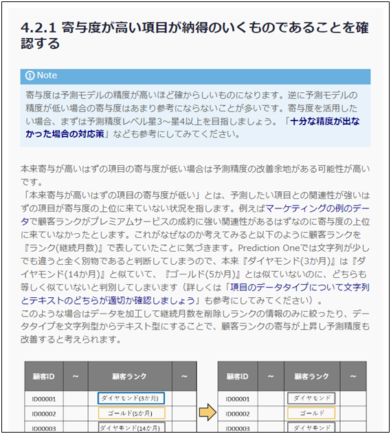

{}
用意し直したデータで予測モデルを作成し、精度を計算すると、上位50人中36人が申込となり「{}」で設定した70%の目標に到達した！ 
となると次のタスクは、「{}」か。ふむふむ、ここではパーソナルトレーニング申込に関連性の強そうな項目が寄与度の上位に来ていることを確認できればOKなのか。うん、あると良さそうと踏んで新たに追加した項目が寄与度上位に来ている。ここら辺は自分の感覚でもパーソナルトレーニングの申し込みに影響するんじゃないかと思っていたから納得だ！ 
  

  
{}

{}
このページでタケシさんは以下のタスクを完了しました。

- 3.1 予測モデルの作成をする
- 4.1.1 目標に即した予測モデルの精度を確認/算出する
- 4.1.2 目標としていた精度を比べ予測モデルの精度が十分であることを確認する
- 4.2.1 寄与度が高い項目が納得のいくものであることを確認する

ここではタケシさんになったと思って進め方ガイドのチェックを埋めてみましょう。
  

  
<link rel="stylesheet", href="../../../../../static/css/help.css">
<a href="../p12/index.html" class="nav nav-tutorial-next">「まとめ」にすすむ</a>
{}
