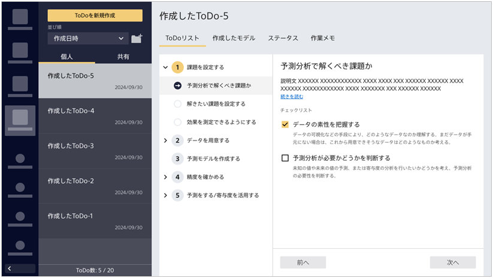

{}
コンピテンシー活動の期末発表でも良い反応をもらえて、実際の業務でPrediction Oneの予測結果を用いたコール施策を実施することになった。これは「{}」で言うと最後の項目「{}」だ。 
  

  
直近3か月以内に入会した顧客に対して予測を実行し、パーソナル契約の確率が高かった人50人にコールしたところ、期待通り35人の申し込みが獲得できた！ 
この実績が評価され、今後もPrediction Oneの予測を使っていく/さらに精度を上げていくことが決定し業務に組み込まれることになった。この前は使えなかった地理データを何とか利用できないか考えてみようかな…！
{}

{}
このページでタケシさんは以下のタスクを完了しました。

- 5.1 予測をする/寄与度を活用する

ここではタケシさんになったと思って進め方ガイドのチェックを埋めてみましょう。
  

  

これで{}における進め方ガイドの使い方の説明は以上です。 
実際にご自身のユースケースでも進め方ガイドをもとに予測分析を業務に導入してみてください。
{}
