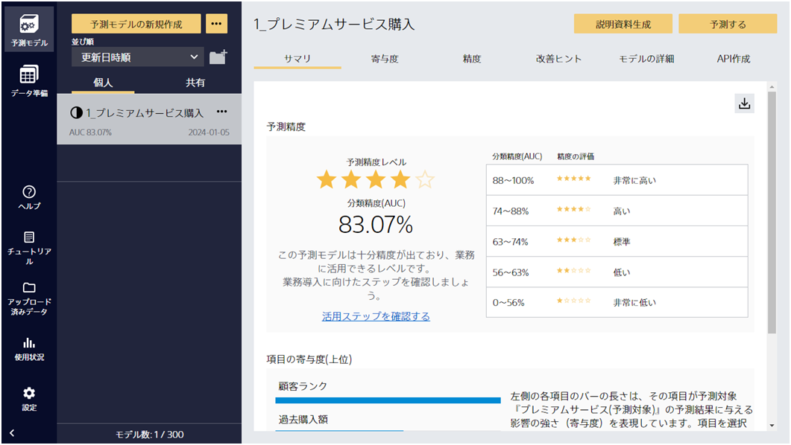
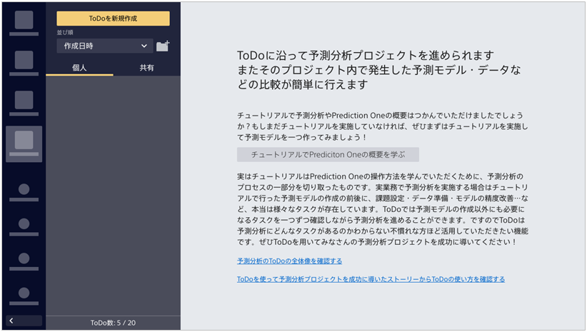
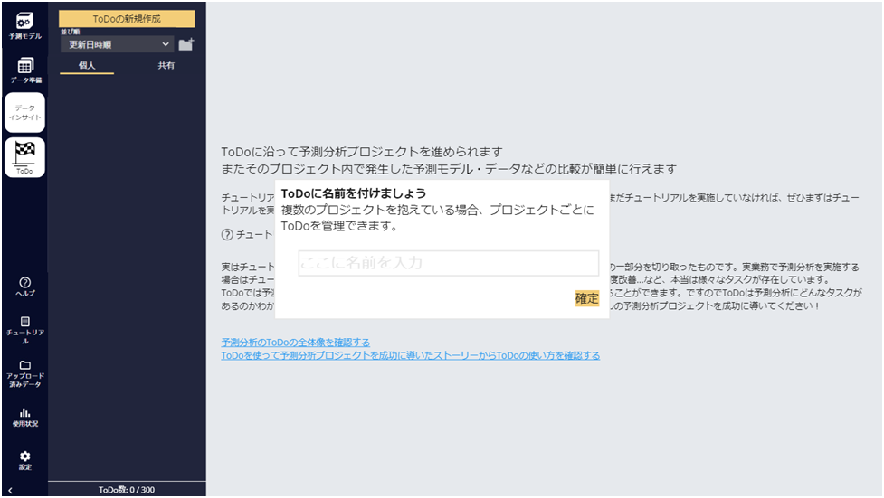

{}
Prediction Oneをダウンロードしてまずは{}を完了した。なるほど、確かにこれは機械学習の知識がない自分でも簡単に予測モデルの作成ができる。しかしいざ自分の業務データでといわれると何をすればよいか…。 
  

{}

{}
例年のコンピテンシー活動の発表を見ていると、ただ勉強をしてきただけではなく、今すぐだったりもうすぐ業務に適用できるんじゃないか、という成果が出た活動の評判が高い。自分もそういった業務の課題を解決できるようなデータ活用ができればいいな…。そういえば、最近の業務課題として営業リストを作っていたカスミさんが異動してからいまいちパーソナルトレーニングのコール施策の購入率が低いことがあったな…。 
Prediction Oneのアプリを操作していると進め方ガイドというものを見つけた。どうやらこれはデータ活用やAI活用に馴染みのない人用に手取り足取り進め方を教えてくれるナビのようだ。 
  

  
まさに自分はデータ活用は不慣れだからこれを見ながら進めよう。マニュアルでも「{}」のページに説明があるみたいだな。 
ということでひとまず進め方ガイドの開始だな。ひとまず営業リストの作成をテーマにする予定だから、名前は「営業リスト」とつけておこう。 
  

  
{}

{}
- まずは予測モデル作成のチュートリアルでPrediction Oneの操作を体験してみましょう
- ここからのストーリーは「{}」も確認しながら読み進めましょう
- タケシさんと同様に「営業リスト」の進め方ガイドを開始してみましょう
<link rel="stylesheet", href="../../../../../static/css/help.css">
<a href="../p3/index.html" class="nav nav-tutorial-next">「予測分析プロジェクトの始まり」にすすむ</a>
{}
