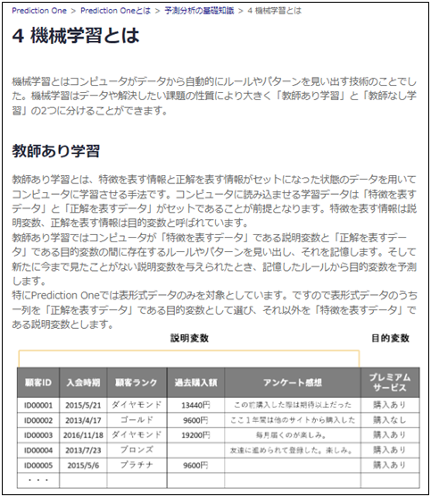

{}
「{}」を読んでみると、予測分析は「課題を設定する→データを用意する→データを前処理する→予測モデルを作成する→精度を確かめる→予測をする」の順番で進むらしい…。 
  

{}

{}
ところで予測分析ってなんだ？どうやら機械学習の一種みたいなんだが…。と思ったら、「{}」というリンクがある。クリック。 
ふむふむ、「{}」によると予測分析は機械学習と深層学習を組み合わせたものらしい。そもそも今までAIとか機械学習とかディープラーニングとか何となく単語だけは知っていて区別がついていなかったが、厳密には違う意味なのか…。 
  

  
それに「{}」によると、予測分析は機械学習の中でも表形式データを対象にした教師あり学習のことらしい…。ちょっとAIについてわかってきた気がするぞ…！ 
  

{}

{}
ひとまず予測分析をするにあたって最初は「課題を設定する」んだな！ 
  

{}

{}
- 予測分析はおおまかに「課題を設定する→データを用意する→データを前処理する→予測モデルを作成する→精度を確かめる→予測をする」の順番で進みます。これからそれぞれのタスクについて詳しく見ていきます。
- 予測分析プロジェクトを進めていくうえでぜひ知っておいてほしいことを「{}」にまとめています(難しい数式を使った説明はありません)。わからないことがあったら是非確認してみてください。先にこのコンテンツを全て読んでしまうのもおすすめです。
- タケシさんが「{}」や「{}」のどこを読んで作業を進めたのか、実際に同じページを確認してみましょう。
<link rel="stylesheet", href="../../../../../static/css/help.css">
<a href="../p4/index.html" class="nav nav-tutorial-next">「『1.1 予測分析が最適なソリューションなのか確認する』に取り組む」にすすむ</a>
{}
