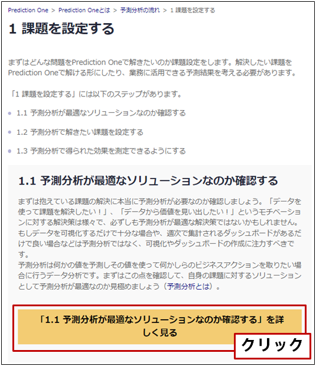

{}
「{}」には、 

- {}
- {}
- {}

のステップがあるのか…。まずは「{}」と…。 
「予測分析は何かの値を予測しその値を使って何かしらのビジネスアクションを取りたい場合に行うデータ分析」で、「もしデータを可視化するだけで十分な場合や、週次で集計されるダッシュボードがあるだけで良い場合などは予測分析ではなく、可視化やダッシュボードの作成に注力すべき」と…。 
ちょっとどういうことなのかわからないから詳細を見てみよう。 
  

  
「1.1.1 データの可視化などで素性を把握する」によると、まずは可視化でデータの特徴をつかむのが大事なのね。これは普段からBIツールで確認しているから大丈夫そうだ。ということは、これから課題を設定してデータの前処理をしていくんだな。 
  

{}

{}
つまり、可視化で単純な原因がわかるような場合はそれで充分ってことだな。うちもBIツールで可視化はされてるけど、それだけから良い営業リストが作れるんだったら苦労しないんだよな…。だからカスミさんが今までは作ってくれていたんだが…。 
「1.1.2 可視化だけでなく未知や未来の値を予測したいのか確認する（もしくは寄与度分析をしたいのか確認する）」では、「将来の値が分かれば業務に役立つような項目があるのであれば、予測分析が価値を生むはず」とあるが、自分は営業リスト、つまり将来にその顧客がパーソナルトレーニングに申し込むかどうか、がわかると嬉しい。つまり予測が価値を生むはずだ。 
  

  
よし、そしたらデータの可視化もできているし、予測が価値を生みそうなことも確認した。つまり「{}」のタスクはこれで完了だ！ 
次は「{}」だな。 
  

  
{}

{}
このページでタケシさんは以下のタスクを完了しました。

- 1.1.1 データの可視化などで素性を把握する
- 1.1.2 可視化だけでなく未知や未来の値を予測したいのか確認する（もしくは寄与度分析をしたいのか確認する）

ここではタケシさんになったと思って進め方ガイドのチェックを埋めてみましょう。タケシさんの会社でBIツールの入力となっているデータはXXXXXXから確認できます。 
  

  
<link rel="stylesheet", href="../../../../../static/css/help.css">
<a href="../p5/index.html" class="nav nav-tutorial-next">「『1.2 予測分析で解きたい課題を設定する』に取り組む」にすすむ</a>
{}
