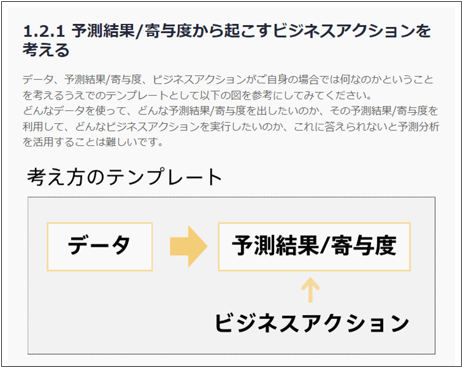
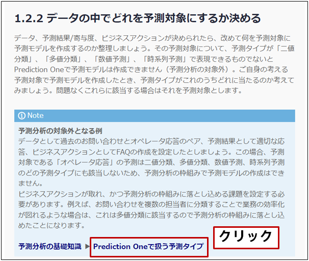
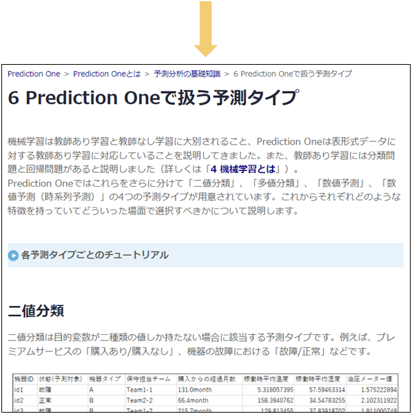
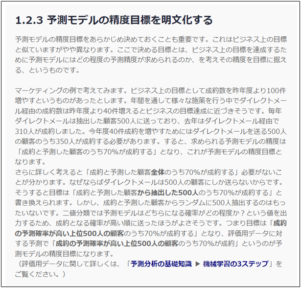

{}
次は「{}」だな。これも一つ一つのタスクで何をすればよいのか詳細を見ていこう。まずは「1.2.1 予測結果/寄与度から起こすビジネスアクションを考える」だな。 
  

  
なるほど、「データ」、「予測結果/寄与度」、「ビジネスアクション」の3点セットを考えると良いんだな。自分の場合は

- データ：会社のBIツールに入力されている顧客データ
- 予測結果：営業リスト
- ビジネスアクション：営業リストをもとにコールする

だな…！
{}

{}
次は予測対象を決めるのか。そういえばPrediction Oneでは営業リストをそのまま予測結果として出力できるんだっけ…？と思ったらまた補足リンクがある。「{}」を見てみよう。 
  

  
そうだった。Prediction Oneでできるのは「二値分類」、「多値分類」、「数値予測」、「数値予測（時系列予測）」の予測だった。二値分類では予測結果とその確率も出してくれる。つまり、パーソナルトレーニングを申込したかどうかを二値分類して、申込確率が高い順に並べたときの上位が営業リストとして使えそうだな。 
つまり予測対象は、「パーソナルトレーニング申込」だ…！
{}

{}
次は…、どのくらいの精度を目標に据えるのかあらかじめ決めておくとよいのか。これは少しややこしいな。 
ええと、過去の履歴を見るとカスミさんが営業リストを作成していた時は10人中7人の割合でコールが成功していた…。そしてコール数は50件ほどか。当時と同じ水準の精度を確保するとなると、目標は「申込確率が高いと予測した上位50人の申し込み率が70%」で良さそうだな。 
  

  
よし、これでビジネスアクションも予測対象も目標も決められた。「{}」のタスクはこれで全部クリアだ。 
次は「{}」だな。
{}

{}
このページでタケシさんは以下のタスクを完了しました。

- 1.2.1 予測結果/寄与度から起こすビジネスアクションを考える
- 1.2.2 データの中でどれを予測対象にするか決める
- 1.2.3 予測モデルの精度目標を明文化する

ここではタケシさんになったと思って進め方ガイドのチェックを埋めてみましょう。特にチェックリストに決めたことを明記できるので活用しましょう。タスクや目標があいまいなまま作業を進めてしまったり、作業を進める中で当初の決定事項があいまいになってしまったりしないようにすることが大切です。
  

  
<link rel="stylesheet", href="../../../../../static/css/help.css">
<a href="../p6/index.html" class="nav nav-tutorial-next">「『1.3 予測分析で得られた効果を測定できるようにする』に取り組む」にすすむ</a>
{}
