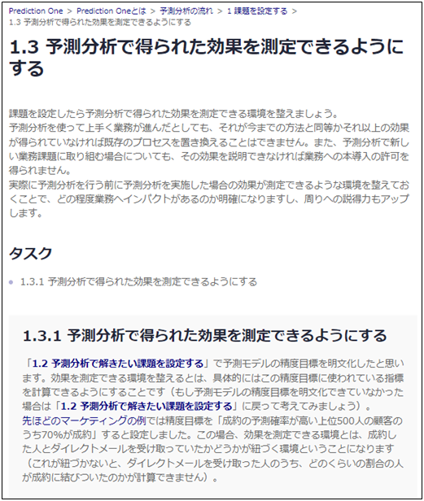
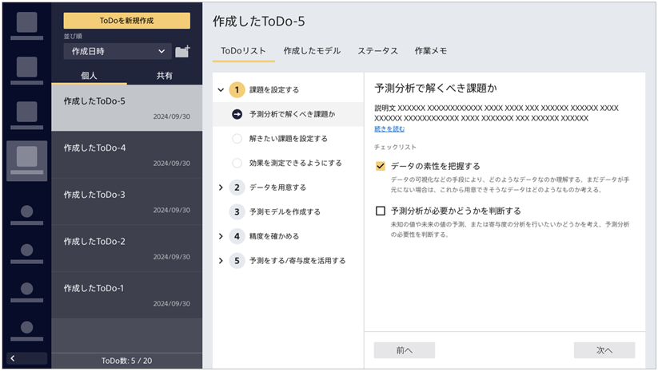

{}
次は「{}」だな。ここでのタスクは「1.3.1 予測分析で得られた効果を測定できるようにする」だけだ。 
ふむふむ、先ほど目標にした精度をちゃんと測定できるようにしましょう、ということか。コールしてパーソナルトレーニングに申し込んでくれたかどうかはちゃんと記録される仕組みがすでに導入されているから自分の場合、これは問題ないな。 
  

  
よし、これで「{}」は全部完了だ！
{}

{}
このページでタケシさんは以下のタスクを完了しました。

- 1.3.1 予測分析で得られた効果を測定できるようにする

ここではタケシさんになったと思って進め方ガイドのチェックを埋めてみましょう。
  

  
<link rel="stylesheet", href="../../../../../static/css/help.css">
<a href="../p7/index.html" class="nav nav-tutorial-next">「『2 データを用意する』に取り組む」にすすむ</a>
{}
