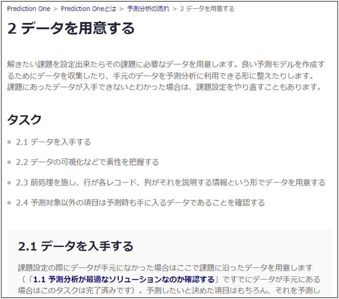
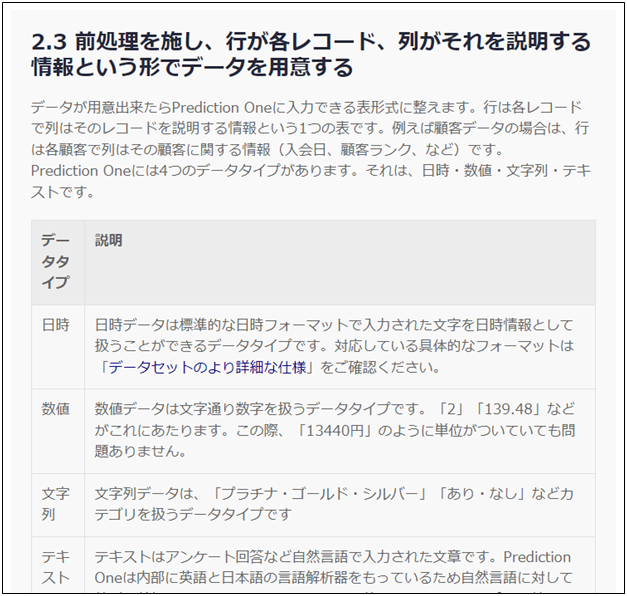
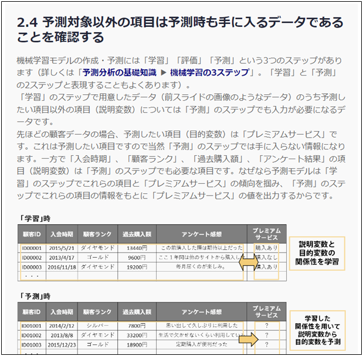

{}
次は、「{}」だ。これに関しては自分の場合すでにBIツールに取り込まれているデータがあるからそれを使えばいいんじゃないのか？でもまずはタスクの詳細を見てみよう。 
「{}」には、 

- 2.1 データを入手する
- 2.2 データの可視化などで素性を把握する
- 2.3 前処理を施し、行が各レコード、列がそれを説明する情報という形でデータを用意する
- 2.4 予測対象以外の項目は予測時も手に入るデータであることを確認する

のステップがあるみたいだ。詳細を読んでみるとこのうち、「2.1 データを入手する」と「2.2 データの可視化などで素性を把握する」は「{}」でデータが手元になかった人用のタスクらしい。よって自分はすでに完了済みだ。 
だから「2.3 前処理を施し、行が各レコード、列がそれを説明する情報という形でデータを用意する」からやればよいことになるな。 
  

  
{}

{}
行は各レコードで列はそのレコードを説明する情報という1つの表形式にデータを表す必要があると…。ちょっとBIツールの元データをダウンロードして確認してみよう…。 
うん、特に問題なさそうだ。完了済みということで飛ばした「2.1 データを入手する」には、データ収集に際して社内の協力を仰ぐというステップもあった。確かにこれをやればもっといろいろなデータが集まりそうな気もするが、次のタスクに進むのも大事ということでまずは次に進んでしまおう。 
  

  
{}

{}
ええと、「学習」「評価」「予測」という3つのステップ…。あれ、これってなんだっけ。リンクにある「{}」をもう一度読んで確認しよう…。 
ああ、そうだ、思い出した。つまり予測の時も用意できる項目しか学習にも使えない、ということだ。自分の場合はすでにコール施策を実施済みの顧客でもまだ実施していない顧客で手に入る情報に差はない。つまり学習時に使った項目は予測時にもちゃんと用意できる。だから問題なさそうだ。 
  

  
よし、これで「{}」も完了だ。次は「{}」だ。
{}

{}
このページでタケシさんは以下のタスクを完了しました。

- 2.1 データを入手する
- 2.2 データの可視化などで素性を把握する
- 2.3 前処理を施し、行が各レコード、列がそれを説明する情報という形でデータを用意する
- 2.4 予測対象以外の項目は予測時も手に入るデータであることを確認する

ここではタケシさんになったと思って進め方ガイドのチェックを埋めてみましょう。
  

  
<link rel="stylesheet", href="../../../../../static/css/help.css">
<a href="../p8/index.html" class="nav nav-tutorial-next">「『3 予測モデルの作成をする』に取り組む」にすすむ</a>
{}
