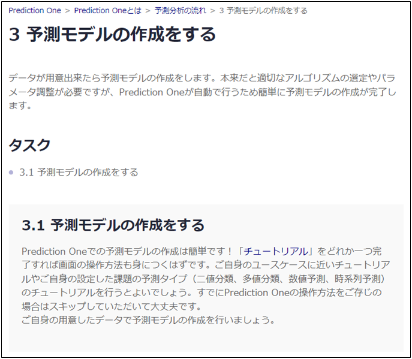

{}
「{}」のタスクは「3.1 予測モデルの作成をする」だけだ。 
{}で行った通り、Prediction Oneではすぐに予測モデル作成が完了する。{}の通りファイルを入力して予測したい項目を選べば…、よし、これで予測モデルの作成も完了だ。 
  

  
{}

{}
このページでタケシさんは以下のタスクを完了しました。

- 3.1 予測モデルの作成をする

ここではタケシさんになったと思って進め方ガイドのチェックを埋めてみましょう。
  

  
<link rel="stylesheet", href="../../../../../static/css/help.css">
<a href="../p9/index.html" class="nav nav-tutorial-next">「『4.1 作成した予測モデルの精度と目標としていた精度を比べる』に取り組む」にすすむ</a>
{}
