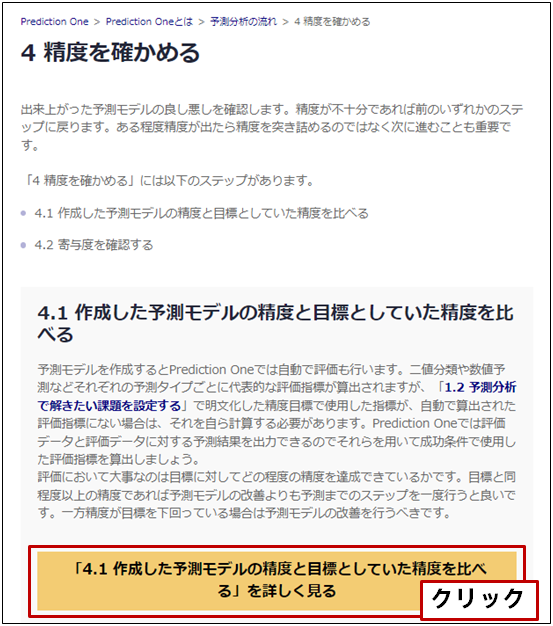
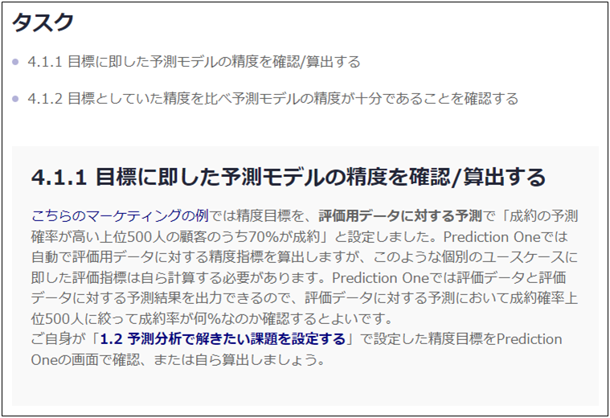
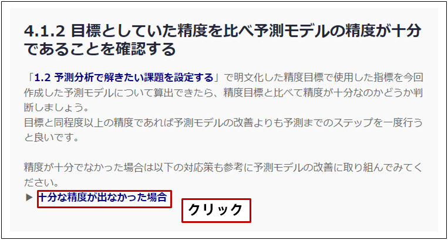
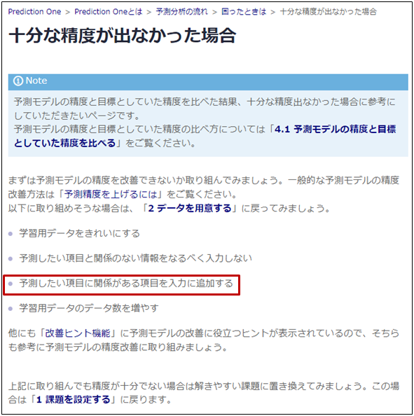

{}
「{}」には、 

- {}
- {}

のステップがあるのか…。まずは「{}」と…。ああ、「{}」で設定した目標と今回作成した予測モデルの精度を比べればよいのか。一応細かいタスクも見てみよう。 
  

  
「4.1.1 目標に即した予測モデルの精度を確認/算出する」によると、個別のユースケースに即した評価指標は自ら計算する必要があるようだ。確かに自分の場合もPrediction Oneが自動で算出する精度指標を目標にはしていないから自分で計算しないとな…。ええと、評価データと評価データに対する予測結果を出力して計算すればいいんだな…！ 
  

  
{}

{}
精度も算出できたから次は「4.1.2 目標としていた精度を比べ予測モデルの精度が十分であることを確認する」だ。予測モデルだと上位50人中パーソナルトレーニング申込に至ったのは31人で62%か…。もともと70%を目標にしていたから、目標には届いていないな…。 
お、「{}」のリンクがある。なるほど…。今はBIツールのデータをそのまま引っ張ってきただけだからユーザ一人ひとりの情報量、つまり項目数は多くないかもな。ユーザの年齢や性別、入会日といった基本的な情報は入っているけど、ジムまでの近さ（住所）、利用時間帯、利用頻度、平均滞在時間とか、もっとパーソナルトレーニングに入ってくれそうかどうかの参考になりそうな情報があるはずだ。 
となると、「{}」に戻ってもう一度トライする必要があるということだ。 
  

  
{}

{}
このページでタケシさんは以下のタスクを完了しました。

- 4.1.1 目標に即した予測モデルの精度を確認/算出する

ここではタケシさんになったと思って進め方ガイドのチェックを埋めてみましょう。
  

  
一方で、以下のタスクを完了できず、「{}」に戻ることになりました。「『2 データを用意する』をやり直す」ボタンを押してやるべきタスクに戻ることができます。こちらもタケシさんと同様にボタンを押してみましょう。

- 4.1.2 目標としていた精度を比べ予測モデルの精度が十分であることを確認する

  

  

タケシさんは「4.1.2 目標としていた精度を比べ予測モデルの精度が十分であることを確認する」まで進めたところで精度が目標に達していないことが分かりました。そこで「{}」を読みパーソナルトレーニングの申し込みに関係のありそうな項目をもっと増やせるかもしれないことに気づきます。ただ、最初から項目を十分用意せずに予測モデルの作成を行ったのは間違いではありません。予測精度が十分出るかどうかはやってみるまで分からないからです。 
予測分析プロジェクトでは予測モデルの作成とデータの改善を何度も繰り返すことがよくあります。あなたもご自身のケースで予測モデルを作成する際は、一度予測モデルを作って諦めるのではなくデータの改善にも取り組んでみましょう。

<link rel="stylesheet", href="../../../../../static/css/help.css">
<a href="../p10/index.html" class="nav nav-tutorial-next">「『2 データを用意する』をやり直す」にすすむ</a>
{}
