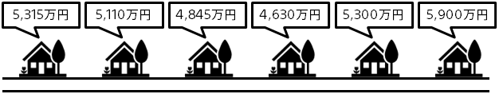

### Introduction

The accuracy and speed of price estimates for real estate transactions, car transactions, procurement of parts and materials, accommodation expenses, ticket sales prices, etc., may be key factors in business.
Predictive analytics enables you to automatically estimate prices from historical close performance data. Automating the price estimation work that used to be performed by people can lead to dramatic efficiency and new business.

For example, Zillow, a real estate portal in the United States (https://www.zillow.com/), is able to accurately estimate the closing price of real estate through predictive analytics. Automating price estimates enables us to calculate estimated prices for almost all properties, even those that are not yet up for sale. Displaying this information on the site succeeded in attracting customers to our own site.

- Real estate owners can see the latest estimated closing price of their property, so they will view it.
- Buyers will be able to see the prices of properties they are interested in even if they are not on the market, so they will view them if they are interested.

