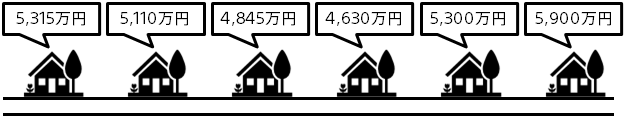

### はじめに　～価格の予測～

不動産売買や車の売買、部品・材料の調達、宿泊費・チケットの販売価格等、成約する価格見積もりの正確さとスピードがビジネス上のポイントになることがあります。
予測分析を利用すると、過去の成約実績データから、価格を自動的に推定できます。これまで人が行っていた価格見積もり業務を自動化できるので、飛躍的な効率化や新規ビジネスにつながることがあります。

たとえば、アメリカの Zillow という不動産ポータルサイト（https://www.zillow.com/）は、予測分析によって不動産の成約価格を高精度に推定することに成功しました。価格推定の自動化によって、まだ売りに出ていないものも含め、ほぼすべての不動産の推定価格を計算できるようになりました。これをサイトに表示することで、自社サイトへの集客に成功しました。

- 不動産オーナーは、自分の物件の最新の推定成約額がわかるので、気になって見に来る
- 購入検討者は、売りに出ていなくても気になる物件の価格がすぐにわかるので、気になったら見に来る

