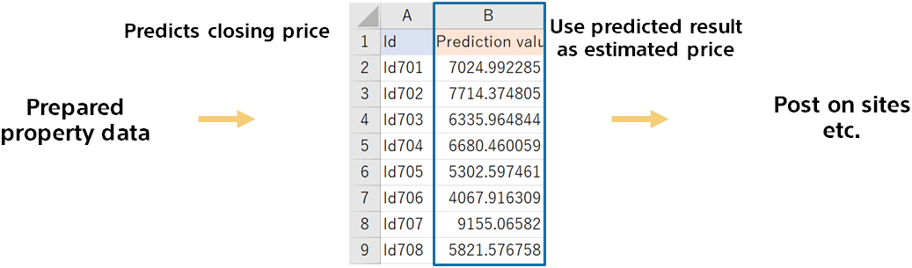

{}

You can now predict the closing price of a house.
Property data is required for price estimation. If you prepare a large amount of this data, you can automatically estimate the price for a large amount of properties.

{}
