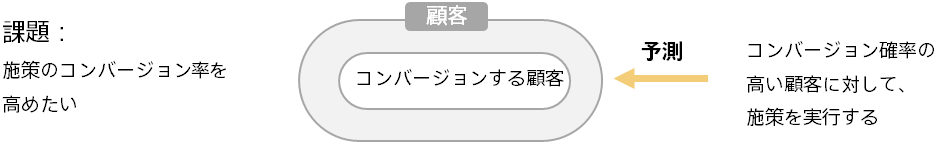

### Introduction: Targeting based on customer behavior prediction

When implementing a marketing campaign (DM delivery, phone calls, coupon distribution, etc.), how you select your target customer (Targeting) will have a major impact on the success of the campaign.

For example, if you are targeting by experience and intuition under simple conditions such as age, you are not fully utilizing the data because only a portion of the data is considered.

Using predictive analytics, you can predict the probability (Conversion Rate) that each customer will use a service based on customer data.

By targeting customers with a high probability of prediction for conversion, you can achieve higher conversion rates.

