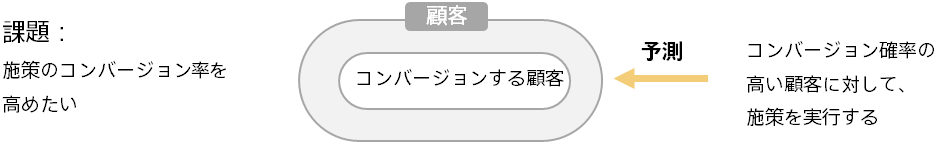

### はじめに～顧客行動予測に基づいたターゲティング～

マーケティングキャンペーンで施策（DM 送付や電話、クーポン配布など）を実施する際、対象顧客をどのように選ぶか（ターゲティング）が、キャンペーンの成功に大きく影響します。

たとえば年齢別など単純な条件で、経験と勘によるターゲティングしている場合、データの一部しか利用できていないため、データを活用しきれているとは言えません。

予測分析を行うと、顧客データに基づいて、各顧客がサービスを使用してくれる確率（コンバージョン率）を予測できます。

コンバージョンの予測確率の高い顧客を施策の対象とすることで、従来よりも高いコンバージョン率を実現できます。

