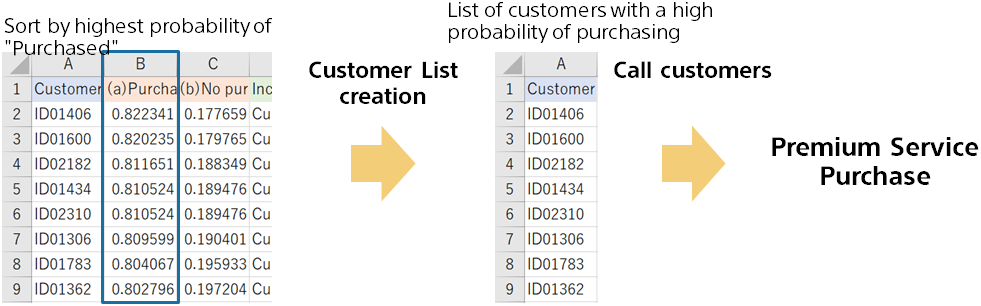

{}

Sort the file of prediction results in order of prediction probability of purchase.
After sorting, select the top 100 customers and include them in the call list for customers with a high purchase rate.
(for example, sending a list of customer IDs to the call center)

The different types of customers may be reflected in the prediction reasons. it may be reflected in the contents of the call.
{}