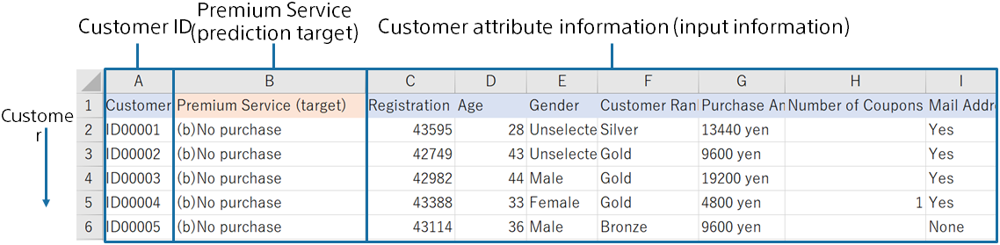

Predictive analytics uses prediction model creation (training) data that combines customer and purchase history data, such as the following, to create a prediction model that predicts purchases. The prediction model trains with the data for creating a prediction model (training) that these customers will or will not make a purchase by call policy.
This tutorial uses sample datasets that were prepared.

{}

The following pages describe how Prediction One operates.
