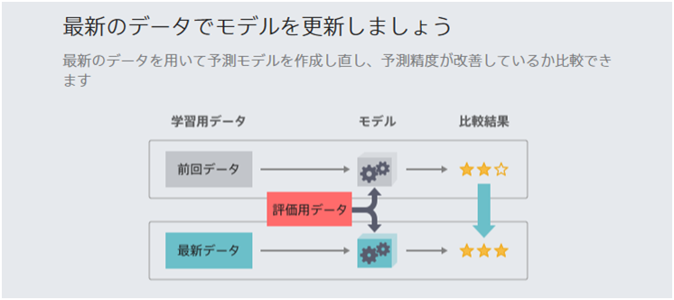

### はじめに～最新データから学習した顧客行動予測に基づいたターゲティング～

チュートリアル {} で
マーケティングキャンペーンにより施策を実施する際に、コンバージョンの予測確率の高い顧客を予測することができるようになりました。

しかし、顧客の傾向は時間の経過とともに変化するため、モデルは古くなると予測精度が下がる傾向にあります。
最新のデータが取れたらモデルを更新しましょう。

更新された最新のモデルを使用することで、従来よりも高いコンバージョン率を実現できます。

<!--
マーケティングキャンペーンで施策（DM 送付や電話、クーポン配布など）を実施する際、対象顧客をどのように選ぶか（ターゲティング）が、キャンペーンの成功に大きく影響します。

たとえば年齢別など単純な条件で、経験と勘によるターゲティングしている場合、データの一部しか利用できていないため、データを活用しきれているとは言えません。

予測分析を行うと、顧客データに基づいて、各顧客がサービスを使用してくれる確率（コンバージョン率）を予測できます。

コンバージョンの予測確率の高い顧客を施策の対象とすることで、従来よりも高いコンバージョン率を実現できます。
-->

 

