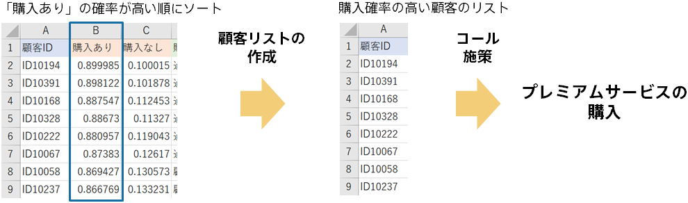

{}

予測結果のファイルに対して、購入ありの予測確率の高い順にソートします。
今回の顧客リストは最新データの傾向も反映しており、また異なる属性の顧客が購入率の高い顧客となっていることが期待されます。

今回も同様に、ソート後に上位 100 名を選び、購入率の高い顧客リストとして、コール施策の対象とします。
（顧客 ID のリストをコールセンターに送付するなどします）

予測理由に顧客のタイプの違いが表れているかも知れません。電話の内容に反映できる可能性があります。
{}
