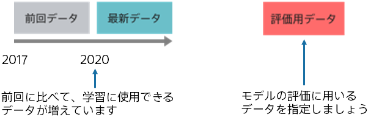
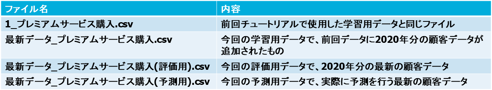

前回学習したときに比べて予測モデル作成(学習)用データが増えたことが想定されます。
最新の顧客傾向を反映したモデルを構築するために、最新のデータを用いてモデルを更新しましょう。

本チュートリアルは、上述の
**_{}_**
で作成したモデルを使用します。本チュートリアルに入る前に上記のチュートリアルでモデルを作成することを推奨します。

{}

今回の予測モデル作成(学習)用データは新しく2020年1月から5月分の顧客データが追加されており、
前回の予測モデル作成(学習)用データに加えて最新データも含めて学習することで精度の向上を目指します。

また評価用データとして、最新の顧客データの2020年6月から8月のものを使用します。
この評価用データを用いて前回学習済みのモデルと精度を比較を行います。

サンプルデータのファイル名と各ファイルの内容は以下の通りです。

以降のページでは、Prediction One の操作について説明します。
