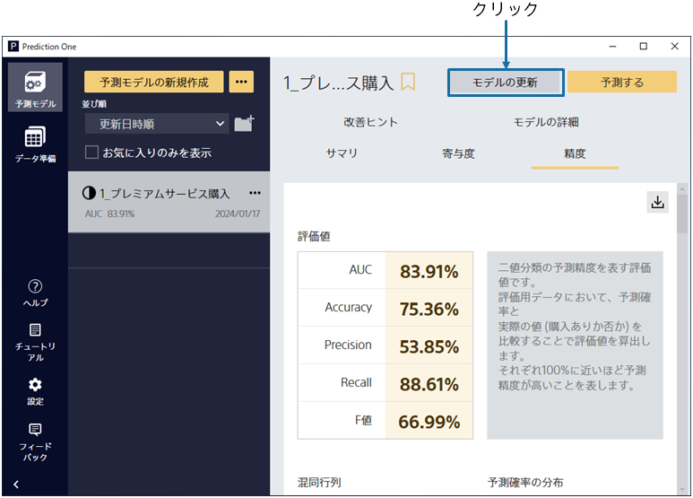
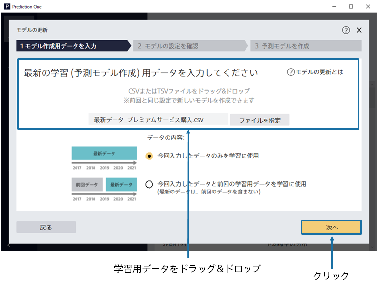
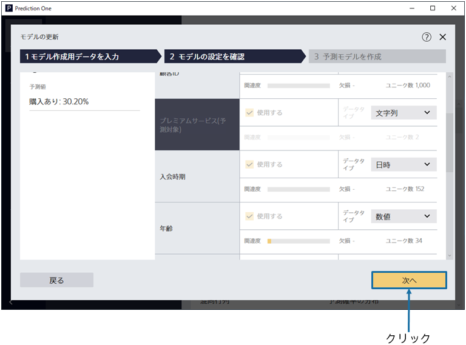
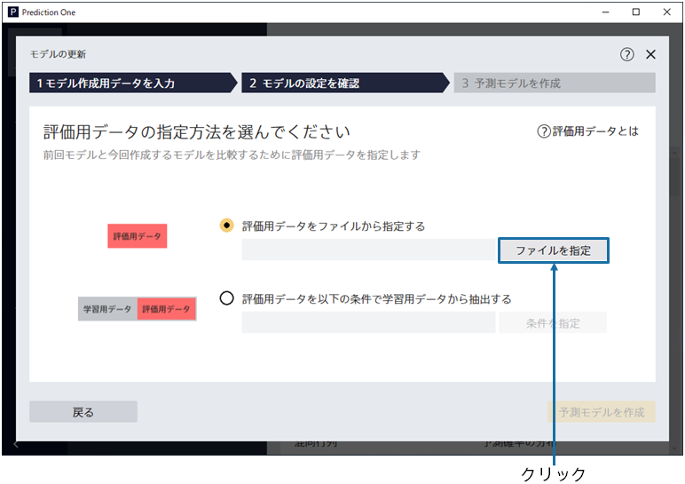
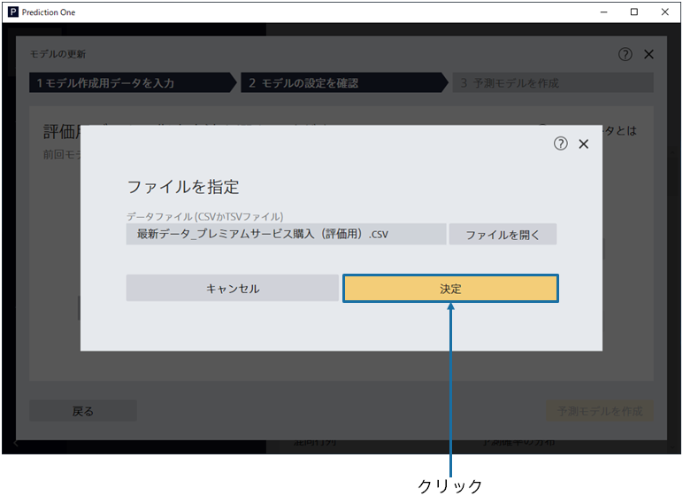
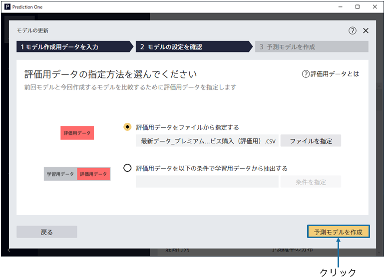

{}

今回更新を行いたいモデルに対し、「モデルの更新」ボタンをクリックすることで新しいモデルを作成できます。
ファイルの入力が終わったら次へボタンを押して、次の画面へ進むことができます。
{}

{}

予測モデル作成(学習)用データである`最新データ_プレミアムサービス購入.csv`を指定してください。 
{}
データはウィンドウへのドラッグ&ドロップか 「ファイルを指定」で読み込むことができます。 
{}
{}
サンプルデータは、「アップロード済みのデータから選択」をクリックし、「サンプル」タブのデータ一覧から選択してください。
{}

{}
{}

{}

データ読み込みが完了すると、この画面が表示されます。 
予測したい項目は前回学習時に使用したものと同様です。現在の項目の設定が正しいかを確認した後、 「次へ」ボタンをクリックしてください。 
{}

{}

更新前のモデルと更新後のモデルを比較するための評価用データを指定します。
評価用データをファイルから指定する場合は、「ファイルを指定」ボタンをクリックします。
{}

{}

学習の時と同様に、「ファイルを開く」ボタン、もしくはドラッグ&ドロップにより評価用データを入力します。
今回のチュートリアルではサンプルデータの`最新データ_プレミアムサービス購入（評価用）.csv`を評価用データに使用します。

{}

{}

「予測モデルを作成」ボタンをクリックすることで学習が開始されますので、完了までお待ちください。前処理 → 予測モデル学習 → 精度評価 → 予測寄与度分析の４つの処理が実行されます。 
待ち時間の見積もりが上部に表示されます。データ量が多いほど時間がかかります。 
学習完了後、完了ボタンをクリックしてください。 
{}

