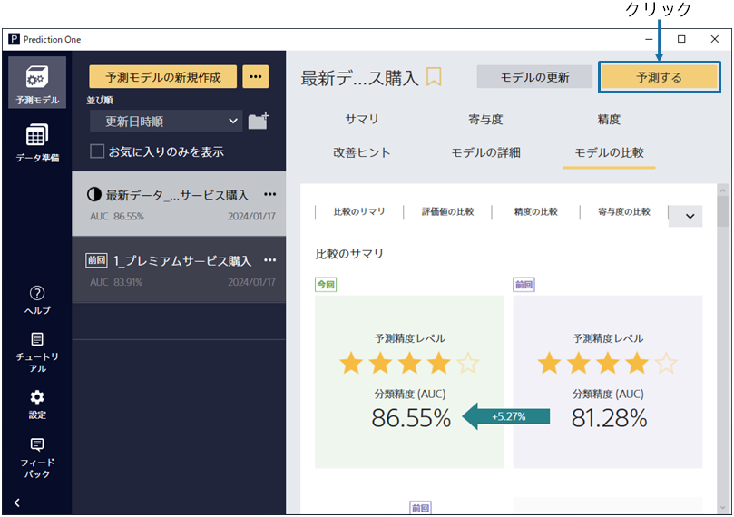

{}

予測モデルの学習後、予測精度の評価までを自動で行います。ここの画面では
今回のモデルと前回のモデルについてモデルのサマリを確認して見比べることができます。

予測精度レベルの精度の違いから、今回のモデルは前回のモデルよりも良い精度でサービスの購入を予測できる事がわかりました！
{}

{}

「モデルの比較」タブ内の評価値の比較では前回モデルと今回モデルの精度の詳細を比較できます。

この表は前回モデルの精度と今回モデルの精度が記述してあり、今回モデルのほうが良い指標については緑色で、
前回モデルのほうが良い指標については赤色で精度の差分が表示されます。
{}

{}

また「モデルの比較」タブ内の寄与度の比較では、
今回モデルと前回モデルの予測理由である予測に寄与している項目を見ることができます。
有効な項目を見比べることで、今回と前回で予測傾向がどのくらい変化しているかを見ることができます。
{}

{}

これらの比較結果から今回モデルの方が精度が良いとわかったので、実際に作成したモデルを用いて予測を行いましょう。
「予測する」をクリックしてください。
{}
